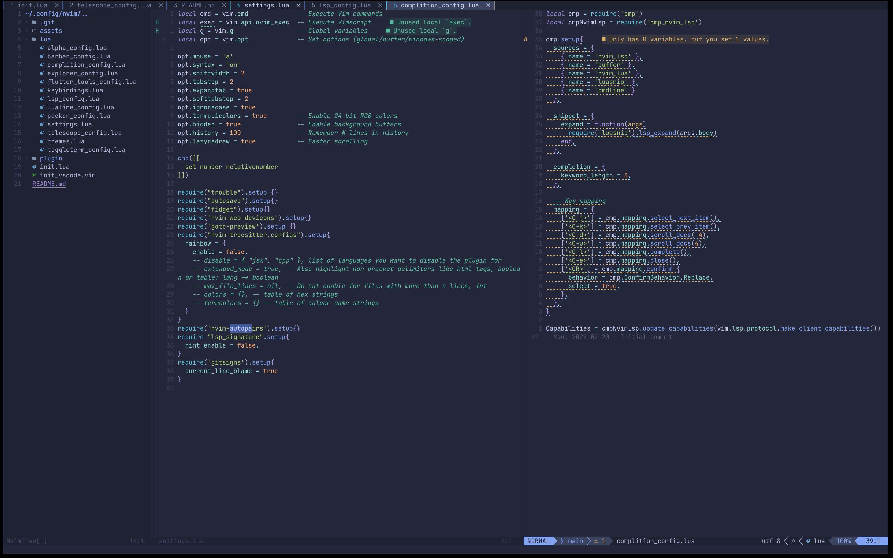
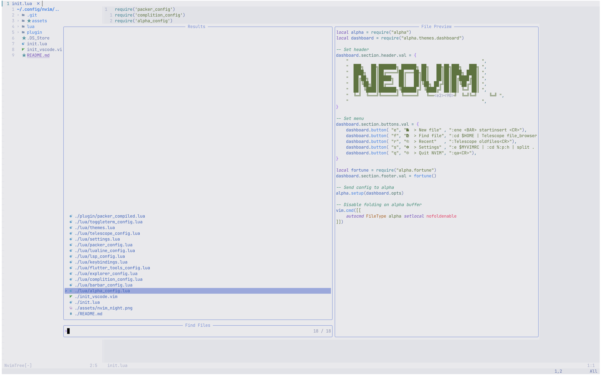
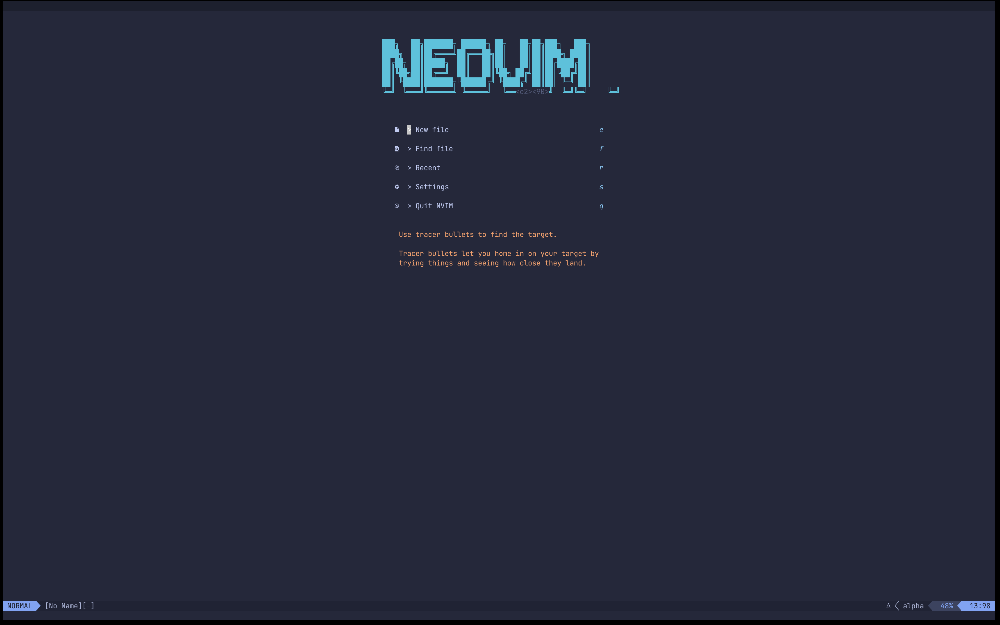

# NeoVim Config

## Screenshots

## What included

- LSP for Dart and Lua
- Code actions such as code complition, go to definition and so on
- Search using Telescope
- Tabs with `barbar`
- File explorer with `nvim-tree`
- Themes with `tokyonight` and `auto-dark-mode`

All packages you can see in `lua/packer_config.lua`

